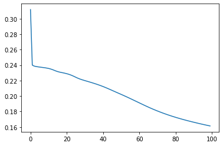

# Cycle-Consistent--VAE

This is an implementation of paper, "Disentangling Factors of Variation with Cycle-Consistent Variational Auto-Encoders" on 2D Sprites dataset.
Link for dataset is : http://www-personal.umich.edu/~reedscot/files/nips2015-analogy-data.tar.gz
The pipeline+prediction_network.ipynb jupyter notebook file can be run for creating dataloader for sprites, training the referred architecture and generating results.
Two prediction networks are trained one for obtaining the z from s features and another for obtaining the s from z features.
Using the predicted z and s features new images are generated.

Libraries to be installed :
pytorch
matplotlib
imagegrid
glob 
scipy

## About :
In this paper a novel architecture is introduced that disentangles the latent spcae into two complementary subspaces by using semi supervised approach in the
form of pair wise similarity of labels. It is also shown that using z- feature we get much lesser accuracy as compared to s-feature,thus proving successful 
disentaglement of latent space.

## Results:
## Style transfer grids
Identity of a character is constant across columns and style of character is constant across rows. 

## Linear Interpolation
Image in left and right corner are from dataset rest are generated and the former one is slowly changed to the latter 
and vice- versa using linear interpolation

## Loss plot for predicting s using z

## Loss plot for predicting z using s

## Images generated using predicted z and s

## Accuracy(in %)

